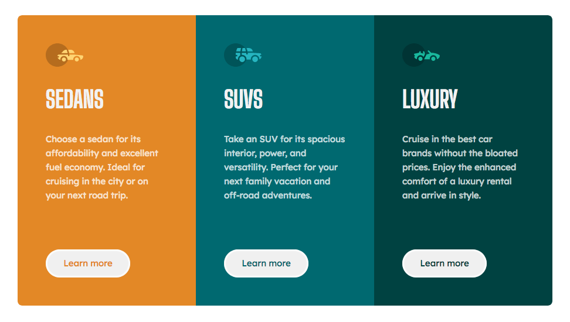

# Frontend Mentor - 3-column preview card component solution

This is a solution to the [3-column preview card component challenge on Frontend Mentor](https://www.frontendmentor.io/challenges/3column-preview-card-component-pH92eAR2-). Frontend Mentor challenges help you improve your coding skills by building realistic projects. 

## Table of contents

- [Overview](#overview)
  - [The challenge](#the-challenge)
  - [Screenshot](#screenshot)
  - [Links](#links)
- [My process](#my-process)
  - [Built with](#built-with)
  - [Continued development](#continued-development)
  - [Useful resources](#useful-resources)

## Overview

### The challenge

Users should be able to:

- View the optimal layout depending on their device's screen size
- See hover states for interactive elements

### Screenshot

### Links
- Live Site URL: [https://ohuttar.github.io/threeColumnPreviewFEM/index.html](https://ohuttar.github.io/threeColumnPreviewFEM/index.html)

## My process

### Built with

- Semantic HTML5 markup
- CSS custom properties
- CSS Grid
- Mobile-first workflow
-Javascript

### Continued development

I will update this project if I receive helpful feedback on semantic HTML, accessibility, and Javascript.

### Useful resources

- [Kevin Powell's Youtube Channel](https://www.youtube.com/@KevinPowell) - Everything I know about CSS I learned from Kevin Powell
